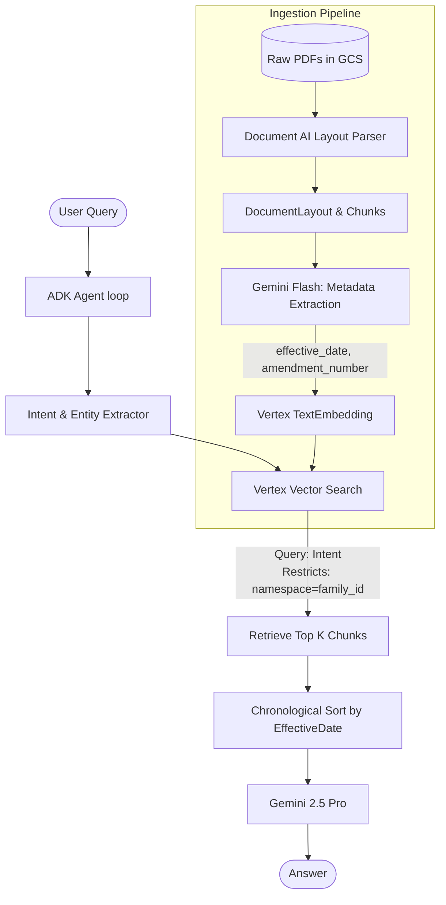

# Technical Specification (SPEC): Legal Contract RAG Agent

## 1. Architecture Overview
Because a naive semantic search chunking strategy fails at chronological overrides, and "full-document injection" is too expensive and slow for real-time Q&A, this agent utilizes a "Hybrid Metadata-Filtered Semantic Retrieval Strategy" on GCP. It relies on strict boolean restricts (not generic metadata) to isolate a contract family, and semantic search to retrieve the relevant chunks. Gemini 2.5 Pro then performs conflict resolution on these chronologically sorted chunks.

## 2. Technology Stack
* **Cloud Provider**: Google Cloud Platform (GCP)
* **LLM**: Gemini 2.5 Pro (Reasoning) & Gemini Flash (Ingestion Metadata Extraction)
* **Document Parsing**: Google Cloud Document AI (**Layout Parser** for hierarchical chunking)
* **Vector Database**: Vertex AI Vector Search
* **Agent Orchestration**: Google Agent Development Kit (ADK) / Vertex AI Reasoning Engine (Python SDK)
* **Storage**: Google Cloud Storage (GCS)

## 3. Data Ingestion Pipeline
1. **Raw Storage**: Raw PDFs uploaded to GCS.
2. **Semantic Parsing**: Document AI **Layout Parser** parses documents, preserving the inherent hierarchy (paragraphs, tables, lists) to create context-aware semantic chunks.
3. **Metadata Extraction via LLM**: Gemini Flash is used via structured output to deterministically extract `effective_date`, `document_type`, and `amendment_number`.
4. **Chunking & Metadata Structure**: The text is packaged for Vertex AI Vector Search. Crucially, filterable metadata (`family_id`) must be assigned to the **`restricts`** field (e.g., `{'namespace': 'family_id', 'allow': ['WaltDisney']}`), while non-filterable contextual data goes into `embedding_metadata`.
5. **Embedding**: Embeddings generated via Vertex AI `TextEmbeddingModel` and chunks are upserted into Vector Search.

## 4. Retrieval & Reasoning Strategy
* **Step 1 (Intent & Entity Extraction)**: Agent detects the legal entity (`family_id`) AND the semantic intent (e.g., "payment terms") from the user query.
* **Step 2 (Targeted Retrieval)**: Queries Vertex AI Vector Search using the semantic intent while applying a strict **`restricts`** boolean filter for the `family_id`.
* **Step 3 (Context Ordering)**: The retrieved Top-K chunks are grouped by document and strictly sorted chronologically by `effective_date`.
* **Step 4 (LLM Injection)**: The targeted, chronologically ordered context is injected into Gemini 2.5 Pro to trace modifications and synthesize the correct answer.

## 5. Deployment
* The Python orchestration logic is packaged using the `google-adk` framework.
* The Agent is published securely via the Vertex AI **Reasoning Engine Python SDK** (`ReasoningEngine.create(app_class)`).

## 6. Files to be Created

### Data Pipeline / Ingestion
- `data_ingestion/upload_to_gcs.py`: Uploads PDFs to Cloud Storage.
- `data_ingestion/process_with_doc_ai.py`: Orchestrates Document AI Layout Parser processor.
- `data_ingestion/llm_metadata_extractor.py`: Gemini Flash structured output for date/type extraction.
- `data_ingestion/parse_doc_ai_json.py`: Extracts semantic chunks and bundles them with LLM metadata.
- `data_ingestion/generate_embeddings.py`: Computes embeddings and formats datapoints with `restricts`.

### Agent Logic (Google ADK)
- `agent/agent_main.py`: Main entry point for the agent orchestration.
- `agent/family_retrieval_tool.py`: Vertex search querying tool passing `restricts` filter and intent query.
- `agent/prompts.py`: Gemini system prompts and instructions.
- `agent/context_grouper.py`: Chronological sorting logic for retrieved chunks.

### Infrastructure Setup (GCP)
- `infra/setup_infra.sh`: Setup GCS buckets, enable APIs.
- `infra/setup_document_ai.py`: Create Document AI Layout Parser processor via Python SDK.
- `infra/setup_vector_search.py`: Create index and endpoint via Python SDK.
- `infra/deploy_agent_engine.py`: Packaging and publishing using `vertexai.preview.reasoning_engines.ReasoningEngine.create()`.

### Evaluation & Data (Reorganization)
- `eval/run_eval.py`: Loop to run agent against target questions.
- `eval/RAG_EVALUATION_QUESTIONS.md`: Moved from root.
- `data/real_contract_families/`: Moved from root.
